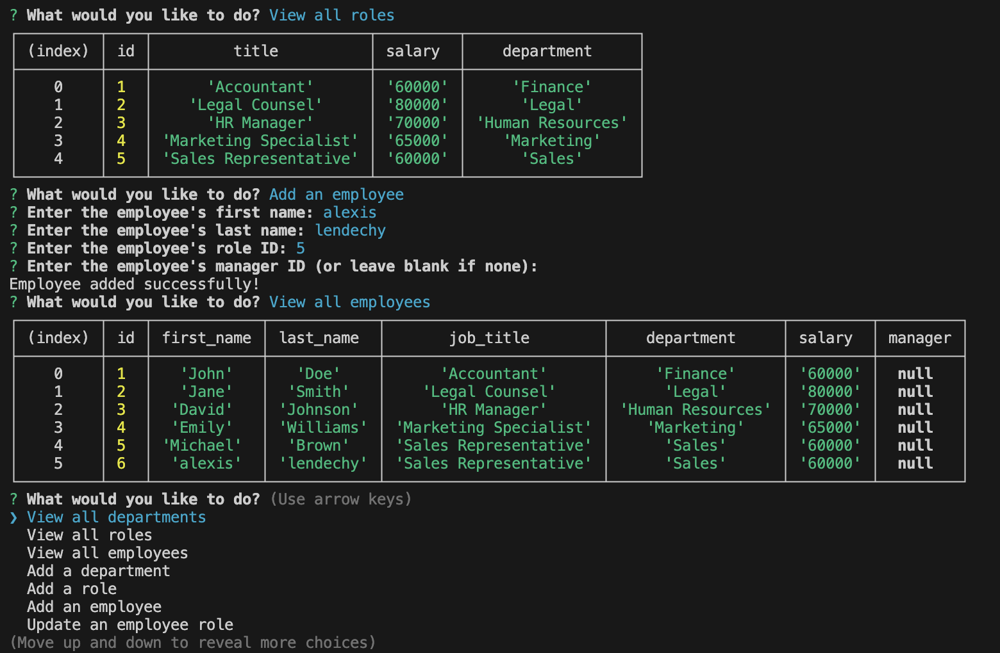

# Employee Tracker

[](https://opensource.org/license/mit/)

This is a command-line application built with Node.js, Inquirer, and MySQL that allows you to manage a company's employee database.



## Table of Contents

- [Getting Started](#getting-started)
- [Usage](#usage)
- [Database Schema](#database-schema)
- [Dependencies](#dependencies)
- [License](#license)

## Getting Started

To get started with this application, you need to have Node.js and MySQL installed on your system.

1. Clone this repository to your local machine:

   ```bash
   git clone github.com/alexislendechy/EmployeeTracker
2. Install the required dependencies:
    ```bash
    npm install
3. Set up your MySQL database by running the provided schema.sql and seeds.sql scripts:

    ```bash
    mysql -u <your_mysql_username> -p < schema.sql
    mysql -u <your_mysql_username> -p < seeds.sql
4. Update the database connection configuration in server.js to match your MySQL setup:
   ```javascript
   const db = mysql.createConnection({
     host: 'localhost',
     user: 'your_mysql_username',
     password: 'your_mysql_password',
     database: 'employee_db',
   }).promise();
5. Start the application:

    ```bash
        npm start
## USAGE

Once you have the application up and running, you can use it to manage your employee database through the command-line interface. The main menu will guide you through the available options.

```bash
Please see below these steps followed:
```
[RECORDING](https://drive.google.com/file/d/19clZAzKBrojTaaZ3w2xRP6_Zgtg_p3Vl/view)

## Database Schema
The application uses a MySQL database with the following schema:

* **`department`:** Stores department information.
* **`role`:** Stores role information, including the department it belongs to.
* **`employee`:** Stores employee information, including their role and manager.

Please refer to schema.sql for the complete database schema.

## Dependencies
* Express: Web framework for handling HTTP requests and responses.
* MySQL2: MySQL client for Node.js.
* Inquirer: Interactive command-line prompts.

## License
This project is licensed under the MIT License.


